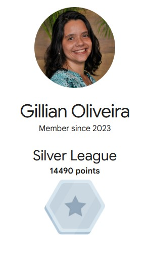

# 👋🏻 Hey everyone! Welcome to my GitHub.
Feel free to call me Lia!

## About Me
🟡 Graduated in Computer Systems Analysis from Anhaguera Educacional.

🟡 Passionate about tech and beach.

🟡 Currently learning Front-end at [Origamid](https://www.origamid.com/) and [Frontend Mentor](https://www.frontendmentor.io/).

🟡 ~~Open to freelance opportunities as a Front-end Developer.~~

🟡 Check out my projects below and feel free to provide feedback or suggestions!

🟡 Contact Me: dev.gillian@gmail.com

## Skills

Skill level:

I have some level of knowledge in all the technologies mentioned below. However, I will update the proficiency level once I add projects to the repository that demonstrate my experience with these technologies.

## Social

## Github Stats

# Latest projects
| # | Status | Title             | Repo                                                                            | Live URL                                                        | TAGS  |
|:--:|:--:   |--                 |--                                                                               |--                                                               |--     |
|11| 🚧work in progress |Newsletter sign-up form| [Newsletter sign-up form repo](https://github.com/lia-oliveira/newsletter-signup-form)| [Newsletter sign-up form repo]()   |HTML5, CSS3, JS|
|10| 🚧work in progress |Bike Craft Store| [Bike Craft Store Repo](https://github.com/lia-oliveira/bike-craft)| [Bike Craft Store Live]()   |HTML5, CSS3, JS|
|9| ✅ |Article Preview Component| [Article preview component](https://github.com/lia-oliveira/article-preview-component)| [Article preview component](https://article-preview-component-ten-rosy.vercel.app)   |HTML5, CSS3, JS|
|8| ✅ |Meet Landing Page| [Meet Landing Page Repo](https://github.com/lia-oliveira/meet-landing-page)| [Meet Landing Page Live](https://meet-landing-page-rosy.vercel.app/)   |HTML5, CSS3, CSS Flexbox|
|7|✅ |Testimonials grid section| [Testimonials grid section Repo](https://github.com/lia-oliveira/testimonials-grid-section)| [Testimonials grid section Live](https://testimonials-grid-section-eight-inky.vercel.app/)   |HTML5, CSS3, Mobile-first workflow, Media Query, Flexbox, CSS Grid|
|6|✅  |Four card feature section| [four-card-feature-section](https://github.com/lia-oliveira/four-card-feature-section)| [Four card feature section Live](https://four-card-feature-section-brown-theta.vercel.app/)    |HTML5, CSS3, Mobile-first workflow, Media Query, Flexbox, CSS Grid|
|5|✅      |Product Preview Card Component| [fm-product-preview-card-component repo](https://github.com/lia-oliveira/fm-product-preview-card-component)| [Product Preview Card Component Live](https://fm-product-preview-card-component-theta.vercel.app/)    | HTML5, CSS3, Mobile-fist workflow, BEM, CSS Grid, CSS Variables |
|4|✅      |Recipe Page| [recipe-page repository](https://github.com/lia-oliveira/recipe-page)| [Recipe Page Live ](https://recipe-page-seven-teal.vercel.app/)    | HTML5, CSS3, Mobile-first workflow, Media Query, Flexbox |
|3|✅      |Social Links Profile | [social-links-profile repository](https://github.com/lia-oliveira/social-links-profile)| [Social Links Profile Live ](https://social-links-profile-one-lac.vercel.app/)    | HTML5, CSS3, CSS Flexbox  |
|2|✅      |Blog Preview Card  | [blog-preview-card repository](https://github.com/lia-oliveira/blog-preview-card)| [Blog Preview Card Live](https://blog-preview-card-seven-ruddy.vercel.app/)  | HTML5, CSS3, CSS Grid, Flexbox, Figma, Design System, CSS Variables, Responsive Web Design|
|1|✅      |QR Code Component  | [qrcode-component repository](https://github.com/lia-oliveira/qrcode-component) | [QR Component Live](https://qrcode-component-khaki.vercel.app/) | HTML5, CSS3, CSS GRID, Flexbox, Figma, Design System|

## Certifications e Badges

[Google Cloud Digital Leader](https://www.credential.net/f45e3397-883f-4e10-9665-1d466aa13ebd#acc.wkVdHxq1)

[Google Data Analytics Certificate](https://www.credly.com/badges/0edf4c5a-b16e-492e-bb4f-010a5b19aadd)

[Google Cloud Skills Boost](https://partner.cloudskillsboost.google/public_profiles/62513d75-6599-45fb-97ff-f3ee2b43c17d)

